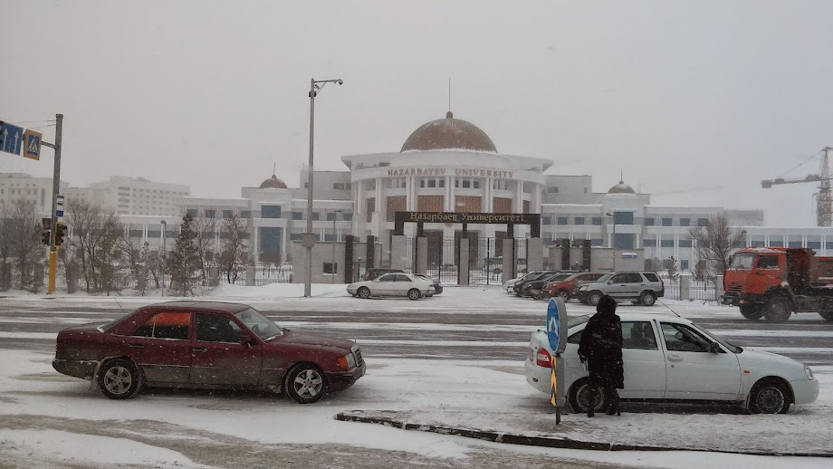
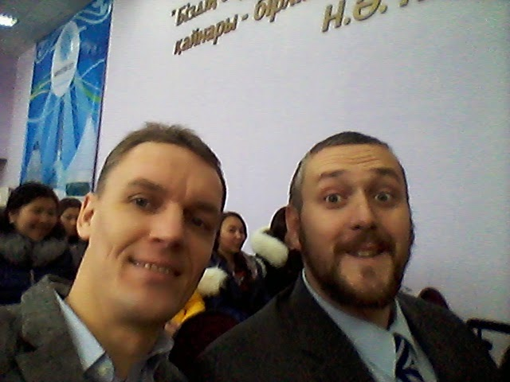

The events of the past few days in Kazakhstan are tragic. The tragedy lies in the lives of the ordinary people who will bare the consequences of the actions of elites and opportunists for the foreseeable future. I have commented much on the issues of Kazakhstan on social media since I am no longer in Kazakhstan and am not a recognized expert in the region. I lived in Kazakhstan for six years - from August 2014 to July 2020 and do have some insight into the country and into the flagship university there. 

Reports are that Nazarbayev has left the country. One of the first images of the protests was of tearing down a statue to Nazarbayev and signs and chants that the old man should go. I have mixed feelings about the whole thing. I worked at a university named for and under the express patronage of the country's dictator. 

## Nazarbayev University

The idea for the university came from various Western advisers. From the beginning of independence, Kazakhstan's leadership had a vision for an independent state with its own trained professionals. The *Bolashak* (future) program was established to send promising students out of the country to receive education. Some of it was ambitious - training nuclear physicists to build nuclear power locally. Those that were trained were required to return to Kazakhstan and to work. It was similar to programs in the US government like the Boren Fellowship that encourages language learning and then requires service in the USG.

Kazakhstan's inherited universities were based on Soviet models and were not competitive by worldwide standards. This was partially due to systemic issues like publishing and language requirements, but also due to a system that was fundamentally noncompetitive. The idea for a university to train the "future cadres" at home while building capacity and bringing prestige was born. Nazarbayev signed on. The university was created independently of the rest of Kazakhstan's education bureaucracy. It was given a huge budget (more on this later) to build a modern campus on the outskirts, but soon to be center, of the growing capital of Astana.

The university became a national project and a national priority. The students and professors that started there in 2009-10 went through a lot to start an institution from scratch.  By the time I arrived, the first students were getting ready to graduate, MA programs were begun, and the first phase of campus construction was nearly complete. With the backing of Nazarbayev, the university was established.

## Undercurrents of Discontent

My entire time in Kazakhstan there were undercurrents of discontent about the university from various places. These came from below, from other educational establishments, and from top. 

"What will it take to get my daughter into your university?"  That was the question that I was asked my first week in Kazakhstan  by a taxi driver. It was assumed that admissions to NU were the same as other universities - available for purchase to augment the meager salaries of the academics that worked there. I was unable to convinced the gentleman that if his daughter could pass the IELTS English exam and the admissions test administered by Cambridge University she could be accepted for free.

"Why aren't our Kazakh universities good enough? We don't need any more foreign influence here!" This was a phrase that was shouted at me by a high school student during a recruiting visit to Karaganda (Nazarbayev's home territory) during my first semester at NU. The conversation was in Russian. Students who didn't have good opportunities to learn English were going to be excluded from the university and that led to resentment. As did the idea that foreigners had to be brought in when there were plenty of qualified Kazakhs. This was a form of nationalism that came and went in waves while I was there.

NU took up a huge chunk of the education budget. Building was expensive, but so were the salaries of the faculty. Salary information was regarded as top secret since it would be politically risky to let people how much that foreign expertise was costing. Faculty salaries were likely a drop in the bucket compared to the money spent on high-priced friends like Tony Blair, but the foreign faculty were compensated **much** differently than the local university faculty - and compared to most Kazakhs were very well-off.

In the first years NU faced a great deal of resentment from the connected class. The first few classes had very few children of the elite. They couldn't buy their way in. While they could afford to send their children abroad, they weren't in NU. Since Nazarbayev had pitched the university as the training ground for future leaders, that was a huge issue. With the early financial crises (2015 was when the states currency was allowed to float and it caused lots of problems), the university became a target. Many elites made accusations that NU was simply a way for certain others to launder money. 

## NU Becomes Something Different

NU did not become the training ground for the elite cadres.  I think there were a few reasons for that. One of the main reasons was that none of the faculty were connected to the elite in meaningful ways. Our students were trained not to go work in the ministries of Kazakhstan, but in a Western model of a liberal arts education. The elites didn't know what to do with our students.

Related to that was that our students spent five years in a bubble *within* their own country. They were allowed to think and to criticize and to question. I had a number of students who went to work in government after graduation and came back to me to tell me that they had no idea how bad things were. They were deficient in the skills of corruption and networking that would put them into the elite.

NU was not a fifth column, but it was very different from what Nazarbayev probably intended for it to become. 

## What's in a Name?

Naming the University after Nazarbayev was probably necessary to get it started and to keep it alive. Now that Nazarbayev is gone, the name is a liability. There is great value in having an independent quality university in the capital. The fate of the university is tied to the fate of the country. It is also tied to the deftness in which the leadership of the university can navigate the politics of making the university a national symbol rather than that of the personalist dictator. Can it survive a political shake up and realignment of elites? Can it survive under the same model without the patronage Nazarbayev? 

I hope and pray that it can and that it will. Just as Nur-Sultan will likely return to its name of Astana, perhaps NU can return to a form of its original name: The New University of Astana.  Perhaps simply Astana University.
